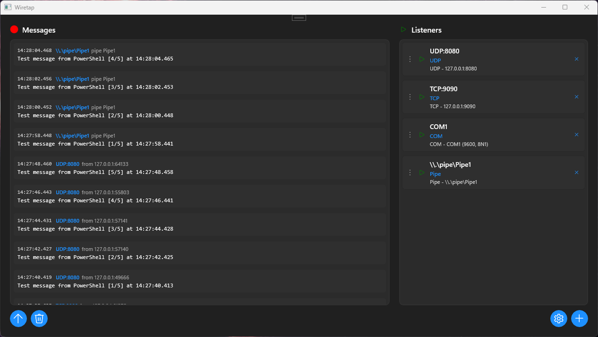
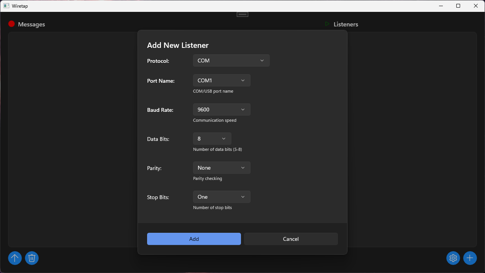

# Wiretap

Wiretap is a Windows 11 application for monitoring real-time data from multiple sources. It supports TCP/UDP networks, named pipes, serial COM ports, and USB devices. The application provides a unified interface for capturing and analyzing data streams, with features such as device filtering, efficient device enumeration, and a WinUI 3-based interface. Wiretap is suitable for tasks including debugging network protocols, monitoring serial and USB devices, and working with embedded hardware interfaces.


*Main interface showing multiple active listeners and data monitoring*

  
*Intuitive listener configuration dialog*

## Features

### Supported Protocols

- **TCP Sockets**: Monitor TCP server connections with configurable IP binding and port settings
- **UDP Packets**: Capture UDP broadcasts and unicast messages on any port
- **Named Pipes**: Windows inter-process communication monitoring for local applications
- **Serial COM Ports**: Full serial communication support with customizable baud rates, data bits, parity, and stop bits
- **USB Devices**: Intelligent detection and monitoring of development hardware (Arduino, ESP32, sensors, etc.)

### Modern User Experience

- **WinUI 3**: Native Windows 11 styling with fluent design principles
- **Real-time updates**: Live data display with automatic scrolling and timestamps
- **Status indicators**: Color-coded connection states and activity monitoring

### Developer-Friendly Tools

- **Testing Script**: PowerShell testing script for all the supported protocols  
- **Smart USB Device Recognition**: Automatically detects and lists only relevant development hardware using a built-in vendor database.

## User Guide

### Getting Started

1. Launch Wiretap. At startup there is a default TCP listener.
2. Click the "+" button to add another listener and select a protocol and configure its settings.
3. Real-time data appears in the main window as they are received by the listeners.
4. Messages can be copied to clipboard by clicking on them.

### Managing Listeners

- **Monitoring** is enabled by default, but may be paused globally or per listener with the ▶ and ⏸ buttons.
- **Remove Listeners**: Click the "×" button to delete unwanted listeners

### Data Monitoring

- **Live Updates**: Incoming data appears instantly with timestamps
- **Source Identification**: Each message shows which listener received it
- **Auto-Scroll**: New messages automatically scroll into view, but the view can be fixed in place by scrolling down. Use the ↑ button to scroll to the top and resume scrolling.

### Tips

- **Check Firewalls**: Ensure Windows Firewall allows Wiretap network access
- **Test Connections**: Use the included test script to verify your setup and identify problems
- **Device Detection**: Connect hardware before starting listeners for best detection

## Implementation & Architecture

### Core Architecture

Wiretap follows a clean MVVM (Model-View-ViewModel) architecture built on .NET 8 and WinUI 3:

- **Models**: Data structures for listeners, messages, and application state.
- **ViewModels**: Business logic and data binding for UI components.
- **Views**: WinUI 3 XAML interfaces with responsive design.
- **Services**: Dependency-injected services for messaging, dialogs, and settings.
- **Listeners**: Protocol-specific implementations inheriting from an abstract `BaseListener` class.

### Key Components

- **USB Device Detection**: WMI (Windows Management Instrumentation) based enumeration with intelligent filtering using vendor ID recognition.
- **Serial Communication**: COM port handling with timeout management and buffer processing.
- **Network Listeners**: Asynchronous TCP/UDP socket management with proper resource disposal.
- **Message Processing**: Thread-safe message queuing with UI marshaling via a `DispatcherQueue`.

### Performance Optimizations

- **Background Threading**: All I/O operations run on background threads to maintain UI responsiveness.
- **Smart Caching**: USB device enumeration cached for 5 minutes with automatic refresh.
- **Resource Management**: Proper disposal patterns for sockets, serial ports, and WMI objects.
- **Memory Efficiency**: Pooled buffers and optimized string handling for high-throughput scenarios.

## Build Instructions

Building via Visual Studio is simple: just clone the repository, open it in Visual Studio, build the solution, and run the program!

### Prerequisites

- **Visual Studio 2022** (17.8 or later) with these workloads:
  - .NET Desktop Development
  - Windows Application Development
- **Windows 11 SDK** (10.0.22621.0 or later)

### Dependencies

The project uses the following NuGet packages:

- **Microsoft.WindowsAppSDK** (1.7.250606001) - WinUI 3 and Windows App SDK
- **System.IO.Ports** (9.0.7) - Serial port communication
- **System.Management** (9.0.7) - WMI queries for USB device detection

## Testing

Wiretap includes a comprehensive testing script to verify that all listener types work correctly on your system.

### Quick Testing

Start Wiretap, add listeners that conform to the settings below, and use the provided `Test.ps1` script:

```powershell
# Test different protocols
.\Test.ps1 -Protocol TCP -Target "127.0.0.1:9090"
.\Test.ps1 -Protocol UDP -Target "127.0.0.1:8080"  
.\Test.ps1 -Protocol COM -Target "COM1"
.\Test.ps1 -Protocol PIPE -Target "MyPipe"

# Interactive mode with guided prompts
.\Test.ps1 -Interactive

# See all available targets on your system
.\Test.ps1 -ListAll
```

### Protocol-Specific Testing

#### TCP/UDP Testing

```powershell
# TCP test - sends 3 messages to localhost
.\Test.ps1 -Protocol TCP -Target "127.0.0.1:9090" -Count 5

# UDP test - broadcasts to local network  
.\Test.ps1 -Protocol UDP -Target "127.0.0.1:8080" -Count 3
```

#### Named Pipe Testing

```powershell
# Test Windows named pipe communication
.\Test.ps1 -Protocol PIPE -Target "MyPipe" -Message "Hello Pipe"
```

#### COM Port Testing (Requires Virtual Serial Port)

For COM port testing, you can download the free [Virtual Serial Port Emulator](https://www.eterlogic.com/Products.VSPE.html) (VSPE), and create a "Connector" type port with ports "COM98" and "COM99".

Then test it by adding a COM listener on port "COM99", and run the test script:

   ```powershell
   .\Test.ps1 -Protocol COM -Target "COM98" -Message "Hello COM"
   ```

#### USB Device Testing (Requires Hardware)

USB testing requires real hardware. Recommended devices:

- **Arduino Uno/Nano** - Common and well supported
- **ESP32 Dev Board** - WiFi + Bluetooth + Serial
- **FTDI USB-to-Serial** - Professional grade converter

**Arduino Test Sketch:**

```cpp
void setup() {
  Serial.begin(9600);
}

void loop() {
  Serial.print("TEMP:");
  Serial.print(random(20, 30));
  Serial.print("C,TIME:");
  Serial.println(millis());
  delay(1000);
}
```

### Troubleshooting

- **Firewall Issues**: Disable Windows Firewall for Wiretap and other test software like VSPE.
- **Port Conflicts**: Use `netstat -an` to check for port usage conflicts.
- **COM Port Access**: Ensure no other applications are using the same COM port. In some cases fixing COM port detection or usage requires removal from Window Device Manager and restarting Windows.
- **USB Detection**: Check Windows Device Manager to verify device recognition.

## License

This project is licensed under the [**CC BY-NC-SA 4.0**](https://creativecommons.org/licenses/by-nc-sa/4.0/) license.
